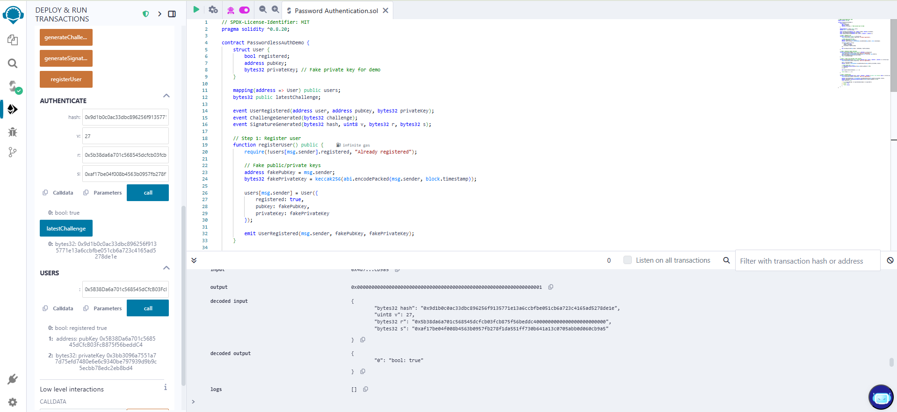
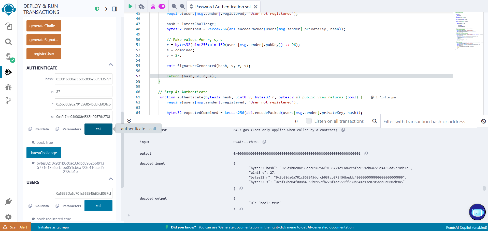

# Experiment 6: Blockchain-Based Passwordless Authentication (Using Public-Private Key Cryptography)
# Aim:
To implement a secure passwordless authentication system using public-private key cryptography on Ethereum. This prevents phishing and password leaks.

# Algorithm:
Step 1: User Registration
A user registers with their Ethereum public key (instead of a password).


Step 2: Login Process
When logging in, the user signs a random challenge message using their private key.


The smart contract verifies the signature using the user’s public key.


# Program:
```
// SPDX-License-Identifier: MIT
pragma solidity ^0.8.20;

contract PasswordlessAuth {
    mapping(address => bool) public registeredUsers;

    event UserRegistered(address user);
    event UserAuthenticated(address user);

    // Register the user
    function registerUser() public {
        require(!registeredUsers[msg.sender], "Already registered");
        registeredUsers[msg.sender] = true;
        emit UserRegistered(msg.sender);
    }

    // Authenticate function that checks if the signed message is from the registered user
    function authenticate(string memory message, uint8 v, bytes32 r, bytes32 s) public view returns (bool) {
        require(registeredUsers[msg.sender], "User not registered");

        // Hash the message with the Ethereum prefix
        bytes32 messageHash = keccak256(abi.encodePacked("\x19Ethereum Signed Message:\n", uint2str(bytes(message).length), message));

        // Recover the signer from the signature (v, r, s)
        address signer = ecrecover(messageHash, v, r, s);

        // Check if the signer is the same as the msg.sender (who's trying to authenticate)
        return signer == msg.sender;
    }

    // Helper function to convert uint to string
    function uint2str(uint _i) internal pure returns (string memory _uintAsString) {
        if (_i == 0) {
            return "0";
        }
        uint j = _i;
        uint len;
        while (j != 0) {
            len++;
            j /= 10;
        }
        bytes memory bstr = new bytes(len);
        uint k = len - 1;
        while (_i != 0) {
            bstr[k--] = bytes1(uint8(48 + _i % 10)); // Use bytes1 instead of byte
            _i /= 10;
        }
        return string(bstr);
    }
}

```

# Expected Output:

Users can register without a password.


Users sign a challenge with their private key for authentication.


The smart contract verifies signatures to confirm identity.


# High-Level Overview:



Eliminates password hacks & phishing attacks.


Uses Ethereum's built-in cryptographic functions.


Inspired by Web3 login solutions like MetaMask authentication.

# RESULT: 
Thus,the execution of the Passwordless Authentication Using Public - Private Key Cryptography has successfully executed.